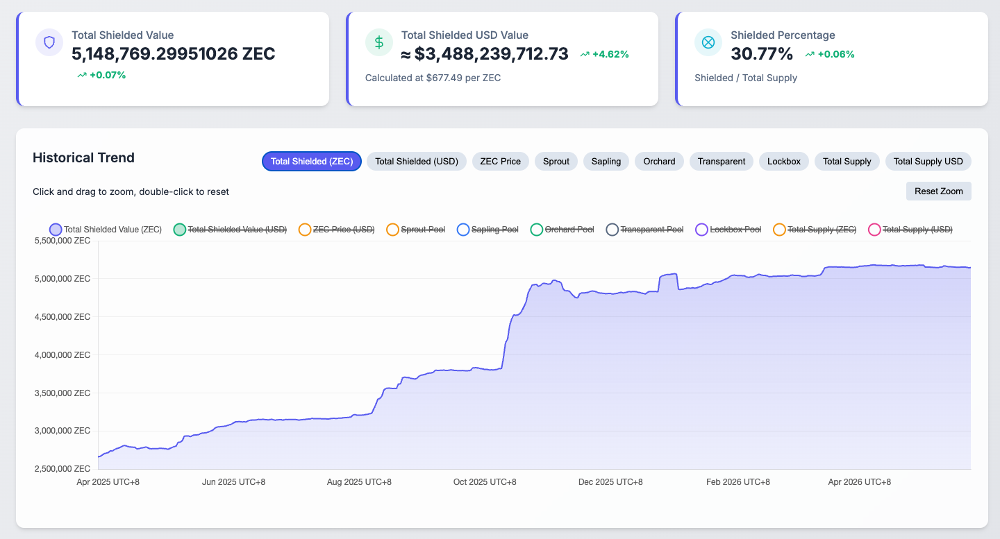
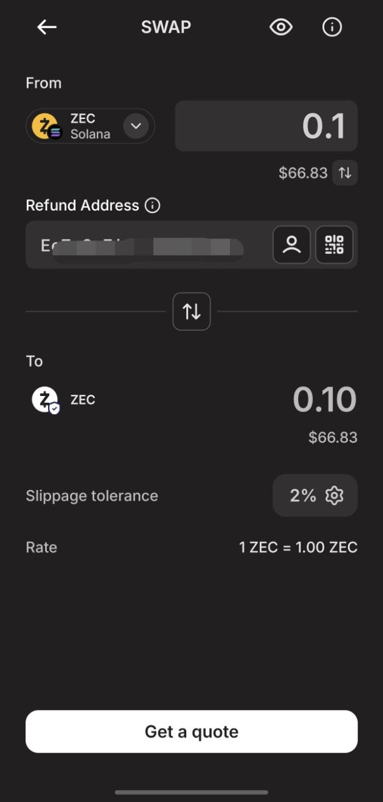
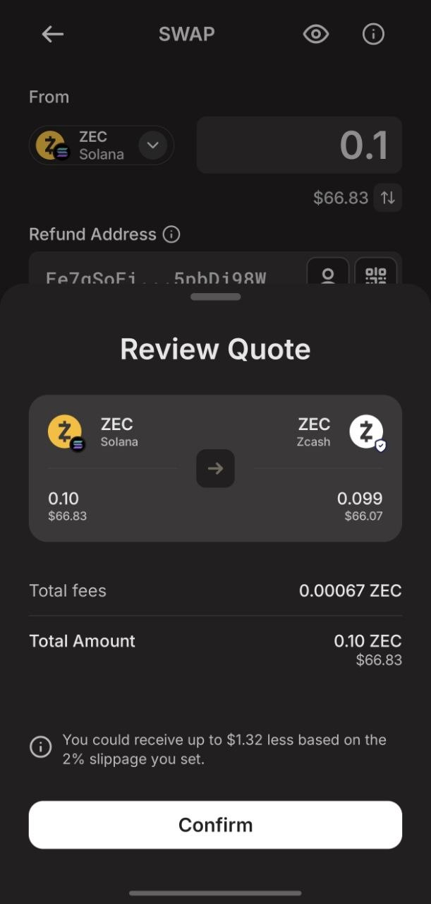
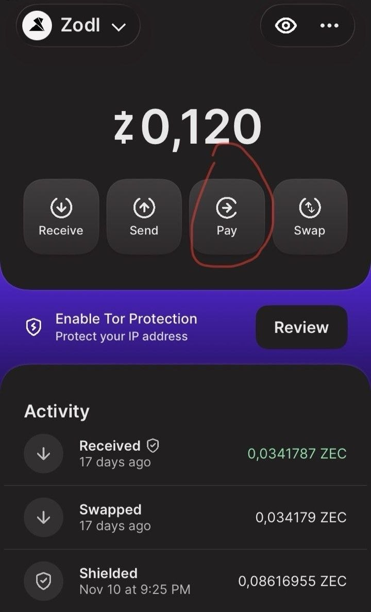
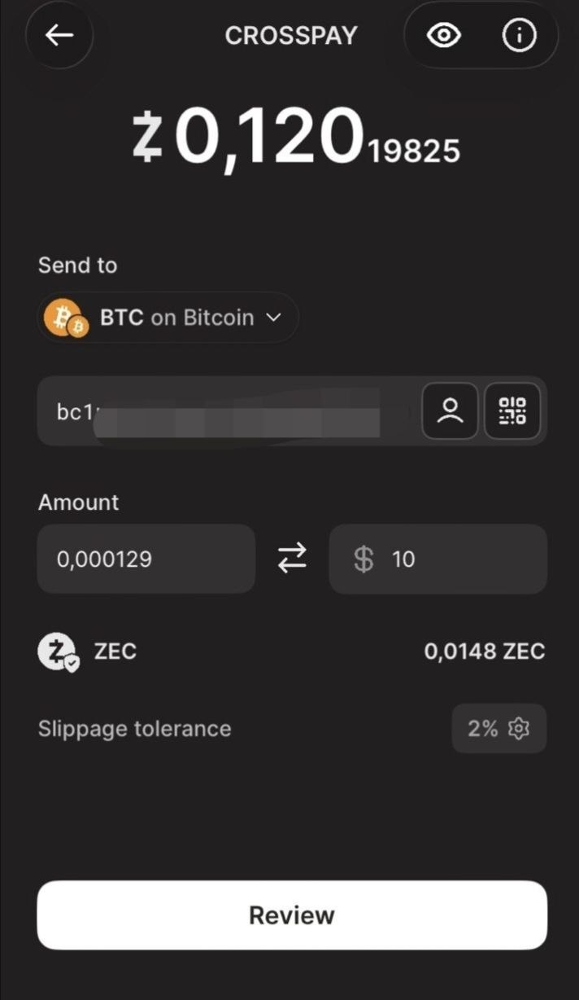

> **🎯 Summary**
> - **Selective Privacy**: Unlike Monero (privacy by default), Zcash offers optional, selective privacy through shielded addresses (*z-address*) and transparent addresses (*t-address*).
> - **Audit & Compliance**: Thanks to *viewing keys*, you can keep your transactions private from the public while sharing visibility with auditors, accountants, or tax authorities.
> - **Zodl & DeGate**: You can swap USDC for ZEC on the Solana network via DeGate Wallet and then swap them into native shielded ZEC using the Zodl app in complete safety.
> - **OP-SEC Best Practice**: To maximize anonymity, let funds rest in the shielded pool and avoid moving identical amounts close to the swap time.
> - **Video Tutorial**: [Watch the quick tutorial on YouTube](https://youtube.com/shorts/ibwzxPPhi0E)

---

Zcash is a cryptocurrency designed to make digital money more private, more resistant to surveillance, and harder to block or censor. Like Bitcoin, it runs on a public, verifiable blockchain; the difference is that Zcash allows you to hide the sender, recipient, and amount through shielded transactions. The point isn't to "hide everything forever," but to give users **control over what to make public and what to keep private**.

This is the most important difference from Monero: Monero aims for strong, uniform privacy for everyone, while Zcash offers selective privacy (learn more in our [Privacy Coins](/en/privacy-coins/) section).

Through Zcash's **viewing keys**, users can keep transactions private from the public while sharing visibility with specific parties, such as accountants, auditors, or tax authorities. This is why Zcash interests not only those seeking personal confidentiality, but also those who need to balance privacy, audit, and compliance. In contexts where the risk of censorship, seizure, or public exposure is high, ZEC can serve as an excellent asset protection tool.

Ultimately, Zcash seeks to offer a form of digital money closer to cash: verifiable by the network, but not necessarily transparent to everyone.

---

## The ZEC Token

The native currency of the network is called **ZEC**: it's used to transfer value on-chain, pay transaction fees, and actively participate in Zcash's decentralized economy.

---

## Traceability and Privacy

Zcash is not automatically private in every transaction: privacy depends on the type of address used and the transaction path. The network remains public and verifiable, but Zcash allows separating the verification of a transaction's validity from the publication of its sensitive details.

In practice, the blockchain can verify that no one is spending non-existent coins or double-spending, without publicly showing who paid whom and what amount was transferred.

Zcash has two main categories of addresses:

* **Transparent addresses (*t-address*)**: similar to Bitcoin addresses. Transactions publicly show the sender, recipient, and amount. They're useful for compatibility with exchanges, wallets, or services that don't fully support privacy, but offer little confidentiality.
* **Shielded addresses (*z-address*)**: designed to hide the main transaction data. When used correctly, the amount and addresses involved are not publicly visible on the blockchain.

---

## What is a Shielded Address?

A **shielded address** is a Zcash address that uses zero-knowledge cryptographic proofs (*zk-SNARKs*) to protect user privacy. Instead of publishing all transaction details, the network receives a mathematical proof demonstrating that the transaction is valid: the sender actually owns the funds, isn't spending them twice, and follows protocol rules.

This allows hiding critical information such as:
- The sender's address;
- The recipient's address;
- The transferred amount;
- The direct link between transaction inputs and outputs.

Privacy is stronger when more users use the shielded pool: the more transactions inside it, the harder it becomes to link a movement to a specific wallet.

As of May 2026, the shielded pool contains approximately 5 million ZEC, worth roughly **$3.5 billion**, with a shielded share of **30.77%** of the total supply. This is significant because it defines the size of the anonymous set: the more ZEC is shielded, the harder it becomes to isolate a single transaction within the pool.

*Source and real-time data: [https://zkp.baby/](https://zkp.baby/)*

---

## Transparent Address (Unshielded)

An **unshielded** address, more commonly called a **transparent address**, is a non-shielded address. Transactions involving these addresses are publicly readable: anyone can see amounts, addresses, and transaction history through a common block explorer.

This means that if a user receives ZEC on a transparent address and then moves them, analysts can follow the flow of funds. As with Bitcoin, the real identity isn't always immediately visible, but once an address is linked to a person, exchange, or service, many past and future transactions can become fully traceable.

---

## Transaction Types and Privacy Level

The effective privacy level depends on the transaction path:

- **Transparent → Transparent**: fully visible, similar to Bitcoin. Sender, recipient, and amount are public.
- **Transparent → Shielded**: funds enter the shielded pool. The entering amount may be visible from the transparent side, but after entry it becomes difficult to follow internal movement.
- **Shielded → Shielded**: the highest privacy case. Addresses and amounts remain completely hidden, and the blockchain only sees that a valid transaction occurred.
- **Shielded → Transparent**: funds exit the shielded pool. The amount and transparent destination address become visible, so this exit can reduce privacy if easily linked to previous deposits or user habits.

---

## Traceability: What's Visible and What's Not

Zcash drastically reduces traceability, but doesn't automatically eliminate it in every situation. Transparent transactions remain analyzable. Even when using shielded addresses, some metadata external to the blockchain can weaken privacy, for example:
- Using centralized exchanges with mandatory KYC;
- Deposits and withdrawals of unusual or very specific amounts;
- Timing too close between entering and exiting the shielded pool;
- Reusing transparent addresses.

Zcash offers extremely robust privacy tools, but users must know how to use them wisely. The best protection is achieved when funds remain in the shielded pool for an extended period and transactions occur exclusively between shielded addresses.

---

## How to Get Shielded ZEC

To obtain shielded ZEC smoothly and efficiently, you need two wallets: **[DeGate Wallet](https://app.degate.com/?s=jack18&utm_source=en_privacy_site&utm_content=ZEC)** and **Zodl** ([https://zodl.com/](https://zodl.com/)). Generate a wallet on both applications.

1. In the DeGate wallet, swap USDC to ZEC on the Solana network. The ZEC token contract address on Solana is: `A7bdiYdS5GjqGFtxf17ppRHtDKPkkRqbKtR27dxvQXaS`.
2. In the Zodl wallet, click on **Swap** and fill in the fields as follows:
    - **From**: select ZEC on Solana and enter the amount of ZEC you want to send.
    - **Refund Address**: enter your DeGate wallet's Solana address.
    Then click on **Get a quote**.

You'll see a screen with the swap quote. If the rate is satisfactory, click **Confirm**.

You'll then see a page with a QR code and a Solana deposit address. Copy this deposit address.

Return to the DeGate wallet and withdraw the ZEC on Solana that you purchased. As the destination address, enter the deposit address you just copied from Zodl.

After sending the ZEC, you'll see the status **Swapping…** in Zodl. Wait for the operation to complete. Once finished, your ZEC will have been securely sent to a native shielded address.

---

## How to Use Shielded ZEC

1. **Send to shielded addresses**: You can send shielded ZEC to another shielded address. This is a **Shielded → Shielded** transaction, which guarantees the highest degree of privacy allowed by the protocol.
2. **Send to transparent addresses**: You can send shielded ZEC to a transparent address (**Shielded → Transparent**). If you want to sell ZEC on a traditional centralized exchange, this step is unfortunately necessary, as virtually no CEX currently accepts direct deposits from shielded addresses.
3. **Convert shielded ZEC to other currencies**: You can convert shielded ZEC to Bitcoin, USDC, ETH, etc. This is one of the most appreciated features by Privacy Maximalists. The procedure is extremely simple:
    
    1. In the Zodl wallet, click on **Pay**.
    
    
    
    2. In **Send to**, select the destination currency and network where you want to receive funds. For example, selecting Bitcoin will automatically convert shielded ZEC to BTC on the native network.
    
    
    
    3. Click **Review**, verify the quote, and press **Confirm** to complete the conversion.

---

## Golden Rules for Using Zcash Correctly

**1. Time spent in the shielded pool is a critical variable**

The time interval between entry and exit significantly impacts anonymity quality. The correct approach is to **enter → stay in the shielded pool for sufficient time (days or weeks) → exit**. Avoid making immediate deposits and withdrawals, otherwise you'll make temporal flow analysis easy.

**2. Exit amounts must be fragmented**

If you deposit 10 ZEC into the shielded pool, avoid withdrawing exactly 10 ZEC to a transparent address. Instead, withdraw fragmented amounts (e.g., 3 ZEC today, 4 ZEC next week) leaving the rest in the pool. This breaks the mathematical correlation of on-chain amounts.

**3. Don't mix different identities in the same wallet**

A wallet should correspond to a single privacy profile. Mixing daily commercial payments and highly confidential transactions under the same seed or viewing key risks compromising your Op-Sec. Use **different wallets with different seeds** for separate purposes.

**4. Plan your fiat exit**

The exit to traditional currency (fiat) is the weakest link in the privacy chain. If you need to convert funds to your local currency, plan ahead using non-KYC channels, P2P platforms, or personal transactions with absolutely trusted counterparts.

> **⚠️ Tax Note:** Even if you use shielded transactions (*z-address*) to protect your personal security (in accordance with your right to privacy), please be aware that tax residents in most jurisdictions are required to report crypto assets and pay applicable taxes on realized gains. Since there are no automatic account statements for shielded transactions, it's your responsibility to keep track of transactions. Always consult a qualified tax professional regarding your specific obligations.

