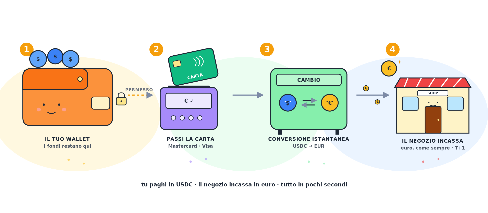

> **🎯 In Sintesi**
> - Una crypto card permette di spendere criptovalute convertendole in fiat al momento dell'acquisto.
> - Le carte **custodial** (come Crypto.com) trattengono i fondi presso un intermediario e possono essere soggette a obblighi di comunicazione CRS.
> - Le carte **self-custody** prelevano i fondi direttamente dal tuo wallet tramite un'autorizzazione smart contract solo al momento del pagamento.
> - Anche se la carta è self-custody, l'utente è comunque tenuto a rispettare i propri obblighi dichiarativi fiscali.

---

## Cosa è, in pratica, una crypto card

Una crypto card è una carta di pagamento che ti permette di usare le tue criptovalute come faresti con un normale bancomat o carta di credito. 
Esteriormente è identica a qualsiasi altra carta — sopra c’è il logo Visa o Mastercard, e funziona ovunque queste vengano accettate: il bar sotto casa, Amazon, una stazione di servizio, un albergo a Tokyo.

Nel momento in cui passi la carta, le tue cripto (bitcoin, ETH, USDC, qualunque cosa supportata) vengono convertite in euro — o nella valuta del commerciante — e quest’ultimo riceve denaro tradizionale, come da qualunque altra carta, a lui non cambierà nulla che stai usando una crypto card o un’altra qualsiasi altra carta di credito/bancomat. 

Quello che cambia è ciò che succede dietro le quinte: alcune carte richiedono che tu ricarichi prima un saldo presso l’emittente, altre lasciano i fondi nel tuo wallet e li convertono in tempo reale al momento del pagamento.

Questa distinzione è importante anche dal punto di vista fiscale e regolamentare: **non tutte le crypto card generano gli stessi obblighi di comunicazione automatica alle autorità fiscali**.

## **CRS** - **il quadro internazionale che regola lo scambio automatico di informazioni finanziarie**

Il primo quadro da considerare è il [**CRS**](https://www.oecd.org/en/publications/consolidated-text-of-the-common-reporting-standard-2025_055664b1-en.html), cioè il **Common Reporting Standard** dell’OCSE. Il CRS è il sistema internazionale con cui le istituzioni finanziarie raccolgono informazioni sui conti detenuti da soggetti fiscalmente residenti all’estero e le trasmettono alla propria autorità fiscale, che poi le scambia con il Paese di residenza fiscale del cliente.

Se un residente fiscale italiano detiene un conto finanziario presso un intermediario estero soggetto a CRS, i dati possono arrivare all’Agenzia delle Entrate tramite lo scambio automatico di informazioni.

Con l’evoluzione del mercato, il CRS è stato aggiornato per includere anche alcune nuove forme di moneta digitale e prodotti di moneta elettronica. Questo è particolarmente rilevante per le crypto card di tipo “prepagato”, **dove il cliente deposita le crypto presso un emittente, una banca o un istituto di moneta elettronica prima di spenderli**. In questi casi, il soggetto che detiene il saldo del cliente può rientrare negli obblighi CRS.

Per esempio, una carta come [**Crypto.com Card**](https://crypto.com/en/cards) è collegata all'account exchange dell'utente: un account custodial, con KYC, presso un intermediario che detiene o gestisce i fondi del cliente. Per questo motivo, le informazioni relative alla carta e alle transazioni possono essere comunicate alle autorità fiscali insieme agli altri dati dell'account exchange.

Diverso è il caso delle carte basate su un modello **self-custody: s**e i fondi restano sempre nel wallet controllato dall’utente, e l’emittente della carta le detiene, l’analisi CRS può cambiare. 
In quel caso non basta dire “è una crypto card”: bisogna leggere attentamente chi è l’emittente della carta, chi detiene le crypto, e se esiste uno “stored value balance”, infine cosa succede esattamente al momento del pagamento.

## Quando una crypto card non dovrebbe generare obblighi CRS

Una crypto card non è automaticamente soggetta a CRS solo perché consente di spendere crypto. Gli obblighi dipendono dalla struttura giuridica e tecnica del prodotto, in particolare da **chi detiene i fondi**, **chi esegue la conversione** e **se esiste un intermediario obbligato alla comunicazione**.

Una crypto card tende invece a non generare un obbligo CRS quando mancano questi elementi:

1. **Nessuna crypto viene custodita dall’emittente della carta.** L’utente non deposita presso il provider della carta e non esiste alcuno stored value account intestato a lui.
2. **Crypto in self-custody fino al pagamento.** I fondi restano in un wallet controllato dall’utente; il provider non può disporne autonomamente.
3. **Il provider è un’interfaccia tecnica, non l’istituto che mantiene il conto.** La carta è collegata a un wallet esterno; non c’è un rapporto di conto con saldo detenuto dal provider.
4. **Nessun prodotto di moneta elettronica ricaricabile.** La carta non emette e-money per il cliente né conserva un saldo prepagato.

## Carta Non-Custodial

Una **carta non-custodial** è costruita in modo diverso da una carta prepagata tradizionale: l’utente non deve trasferire prima le sue crypto a un conto del provider né ricaricare un saldo interno. I fondi restano nel suo wallet fino al momento del pagamento.

Questo modello cambia l’analisi CRS, perchè l’emittente NON detiene fondi del cliente. Attenzione però: non significa che la transazione sia interamente fuori dal perimetro fiscale. Significa solo che **l’emittente della carta potrebbe non essere il soggetto CRS-reportable**. Altri soggetti della catena — chi esegue la conversione, il settlement, il trasferimento on-chain — possono comunque avere obblighi propri.

## Come funziona, in pratica

L’idea di fondo è semplice: **i tuoi fondi restano nel tuo wallet fino al secondo esatto in cui paghi**. Non li trasferisci mai a un conto del provider, non ricarichi un saldo in anticipo come faresti con una carta prepagata tradizionale.

Ecco cosa succede dietro le quinte, raccontato senza tecnicismi:

1. **Autorizzazione limitata, non trasferimento**
    
    Quando configuri la carta, dai al provider un permesso — in linguaggio tecnico una *allowance*, scritta in uno smart contract — di prelevare dal tuo wallet una quantità massima di stablecoin (per esempio fino a 1.000 USDC al mese). È una delega revocabile in qualsiasi momento: i fondi restano nel tuo wallet, sotto il tuo controllo. Non è un trasferimento, è un permesso.
    
2. **Al momento del pagamento, il circuito carta funziona come sempre**
    
    Quando passi la carta al supermercato, il POS invia la richiesta a Mastercard o Visa, che la inoltra all’issuer processor della carta. Esattamente come una carta tradizionale.
    
    Qui è importante chiarire un punto: Visa e Mastercard sono il circuito di pagamento, non il soggetto che custodisce i tuoi fondi o il tuo dossier KYC. I dati personali completi del titolare — identità, residenza fiscale, verifica KYC — sono detenuti dall'issuer o dal provider della carta, non dal circuito in sé.
    
3. **Prelievo, conversione e via libera — tutto in pochi secondi**
    
    L’operatore del programma usa la tua allowance per prelevare dal tuo wallet esattamente l’importo necessario in stablecoin, lo converte immediatamente in euro tramite un liquidity provider, e dà l’ok all’autorizzazione del pagamento.
    
4. **Il commerciante riceve euro, non crypto**
    
    Per il negozio l’esperienza è identica a una carta tradizionale: incassa euro sul proprio conto secondo le tempistiche normali.
    

Il punto chiave è questo: **non devi prima trasferire i fondi su un conto o wallet custodial del provider; il denaro usato per la spesa viene prelevato direttamente dal tuo wallet self-custody, solo al momento del pagamento e nei limiti dell’autorizzazione concessa**.

## Esempi di carte non-custodial

### [MetaMask Card](https://metamask.io/card)

Carta legata al wallet MetaMask (Consensys). Per gli utenti europei l’issuer è **Monavate Limited**, un Electronic Money Institution regolamentato nel Regno Unito. Circuito Mastercard.

Per usarla serve solo il wallet MetaMask con dentro USDC su una delle reti supportate (Linea, Base o Solana). Nessun top-up, nessun saldo custodito dal provider.

Disponibile in oltre 50 paesi, tra cui Italia, resto della UE, Regno Unito, Svizzera, USA, Canada e diversi paesi dell’America Latina.

Full KYC Obbligatorio.

### [Gnosis Pay](https://gnosispay.com/card)

Carta del progetto Gnosis. L’issuer è **Monavate Limited** (Regno Unito), su licenza Visa. Il lato fiat è gestito da **Monerium**, un Electronic Money Institution islandese che emette la stablecoin EURe e fornisce l’IBAN dell’utente.

Per usarla serve un account Gnosis Pay, una Gnosis Safe (smart contract wallet self-custody) ed EURe nel Safe — caricabile tramite bonifico SEPA grazie al rapporto integrato con Monerium.

Disponibile per i residenti dello Spazio Economico Europeo (UE più Islanda, Liechtenstein, Norvegia) e in alcuni paesi dell’America Latina.

Full KYC Obbligatorio.

### DeGate Card

Carta del progetto [DeGate](https://app.degate.com/it/?utm_source=it_privacy_site&utm_content=article_cryptocard), annunciata per il lancio nel Q3 2026 e al momento in fase [waitlist](https://card.degate.com/?utm_source=article_cryptocard_it), alla quale è già possibile iscriversi. 

È costruita sopra DeGate Wallet, un wallet self-custodial. La carta usa il circuito Visa. Il lato issuer, banking e compliance è gestito da **Upfinance**, fintech con sede a Hong Kong, quindi fuori Unione Europea.

Per usarla, i fondi restano nel DeGate Wallet fino al momento del pagamento: niente top-up preventivo, niente saldo custodito dal provider. L’autorizzazione è on-chain e il pagamento viene regolato in **USDC**, nei limiti dell’autorizzazione concessa dall’utente.

La carta promette carta virtuale e fisica e copertura globale, ma con KYC obbligatorio, rollout graduale e disponibilità effettiva dipendente dalla giurisdizione dell’utente e dall’issuer regolato.

## Cosa cambia per un residente fiscale italiano

Anche se una carta non fosse CRS-reportable o CARF-reportable per il provider, questo non elimina gli obblighi personali dell’utente. Per un residente fiscale italiano, l’uso della carta può comunque comportare monitoraggio fiscale e calcolo di eventuali plusvalenze/minusvalenze, soprattutto quando la spesa implica una conversione crypto → fiat.

In breve: **meno reporting automatico del provider non significa zero dichiarazione per l’utente**.