> **🎯 In Sintesi**
> - **Privacy On-Chain Pratica**: NEAR Confidential Mode permette di mantenere private le attività on-chain (saldi, trasferimenti, swap) senza cambiare wallet o usare strumenti complessi.
> - **Doppia Modalità**: Ogni account ha una parte Main (pubblica) e una Confidential (privata). Puoi spostare i fondi tra le due in qualsiasi momento.
> - **Protezione per i Trader**: Nascondendo i dettagli delle transazioni, Confidential Mode protegge da MEV, frontrunning e analisi on-chain.
> - **Facile da Usare**: Puoi accedere a NEAR Confidential Mode direttamente tramite il tuo [DeGate Wallet](/wallets/) senza KYC e mantenendo la completa custodia dei tuoi asset.

---

NEAR Confidential Mode è una funzione di near.com pensata per aggiungere privacy alle attività on-chain senza obbligare l'utente a cambiare wallet, usare strumenti separati o imparare un nuovo flusso tecnico.

L'idea è semplice: lo stesso account ha due modalità operative, una pubblica e una confidenziale. La differenza più importante rispetto a una blockchain completamente trasparente è che, in Confidential Mode, i dettagli sensibili della transazione non vengono mostrati pubblicamente on-chain. Importo, mittente, destinatario e dettagli dello swap non sono esposti come in una transazione normale. L'utente può quindi usare la blockchain senza trasformare ogni movimento finanziario in un dato leggibile da chiunque, migliorando notevolmente la propria [privacy](/varie/).

---

## NEAR Confidential Mode

Confidential Mode divide l'esperienza utente in due "tasche" dello stesso account:

- **Main Account**: è l'account normale. Le attività sono visibili on-chain, come in una blockchain pubblica tradizionale.
- **Confidential Account**: è la parte privata. Saldi, attività e trasferimenti sono cifrati on-chain e visibili solo all'utente, salvo eventuali meccanismi di disclosure previsti dal sistema.

L'utente può spostare fondi tra Main e Confidential in qualsiasi momento. Quando i fondi sono nella parte Main, la logica è quella della normale trasparenza blockchain. Quando vengono portati nella parte Confidential, l'attività avviene in un ambiente disegnato per non esporre pubblicamente i dettagli sensibili.

Near.com segnala anche visivamente il cambio di modalità: quando Confidential Mode è attivo, l'interfaccia passa a un tema scuro, così l'utente sa di stare lavorando nel saldo confidenziale.

---

## Come funziona tecnicamente

NEAR Confidential Mode è alimentato da **NEAR Confidential Intents**, una versione confidenziale dell'architettura NEAR Intents.

NEAR Intents funziona in modo diverso da un normale swap manuale. Invece di scegliere tutti i passaggi tecnici, l'utente esprime un risultato desiderato: per esempio "voglio scambiare questo asset per quell'altro asset". A quel punto, una rete di market maker o *solver* compete per offrire la migliore esecuzione. Se l'utente accetta la quote, l'esecuzione viene verificata e regolata tramite smart contract.

Nel caso di Confidential Intents, questa logica viene portata dentro un ambiente più riservato:

- Le transazioni vengono eseguite su una **NEAR private shard** dedicata;
- La private shard è gestita da un set decentralizzato di validatori permissioned indipendenti;
- Un **TEE-based bridge** collega la private shard alla mainnet NEAR;
- I dettagli della transazione restano fuori dalla vista pubblica della mempool e dei block explorer tradizionali;
- L'utente non deve generare prove ZK (Zero-Knowledge) lato client o usare un setup wallet complesso.

Quindi il punto non è solo "nascondere una transazione", ma spostare l'esecuzione in un ambiente dove l'informazione sensibile non viene resa pubblica prima o durante il *settlement*.

---

## Tutorial: Come usare NEAR Confidential Mode

Per prima cosa, devi creare un account su near.com. Il sito consiglia di usare una passkey per creare l'account: è una soluzione comoda e veloce. Però fai attenzione: al momento near.com **non permette ancora di esportare la chiave privata**. Creare un account con passkey introduce una dipendenza dalla piattaforma e alcune limitazioni per l'utente.

Per questo consigliamo di creare l'account collegando un wallet Web3 di tua proprietà, come un buon [self-custody wallet](/guide/cosè-un-self-custody-wallet/). In questo modo mantieni il pieno controllo e maggiore autonomia nella gestione del tuo account su near.com. La creazione dell'account avviene senza KYC, ovviamente.

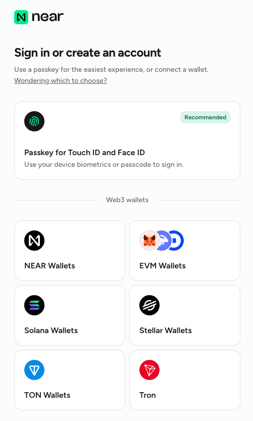

Utilizziamo **DeGate Wallet** come esempio per mostrare come usare NEAR Confidential. È veramente a portata di mano per tutti.

1. **Scarica l'app DeGate** su mobile dal sito ufficiale (https://app.degate.com/en/download).
2. **Crea un DeGate Wallet**.
   *È consigliato creare un nuovo wallet generando una seed phrase. È la modalità più self-custody e sicura.*

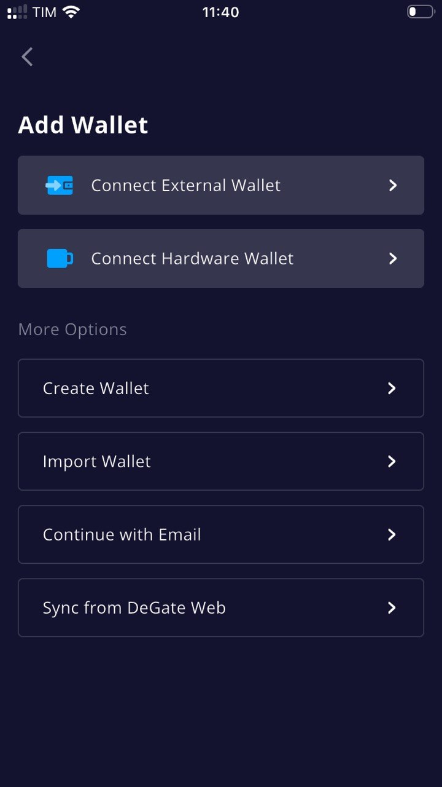

3. In DeGate Wallet, deposita l'importo di USDC che vuoi utilizzare su [near.com](https://near.com/). 
   *Puoi depositare sulle reti più utilizzate, come Ethereum, Solana, Base, Arbitrum e Polygon.*

4. In DeGate Wallet, vai sulla sezione "**Browser**". Nella barra di ricerca, digita `near.com`.

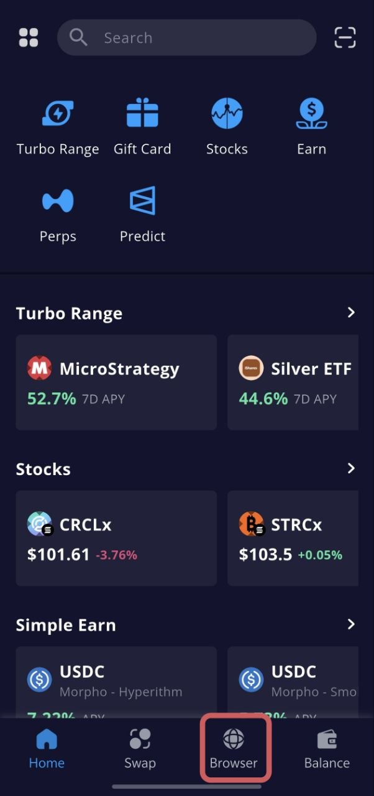

5. Una volta arrivato su near.com, clicca "**Sign in**". A questo punto appare una serie di wallet tra cui scegliere. Scegli DeGate Wallet.

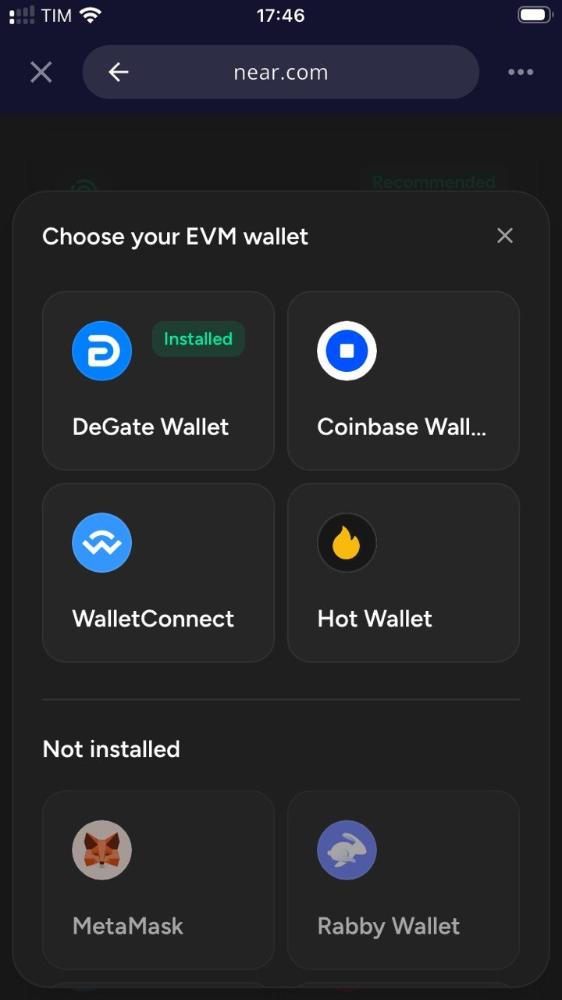

6. Firma il messaggio per creare un account near.com.

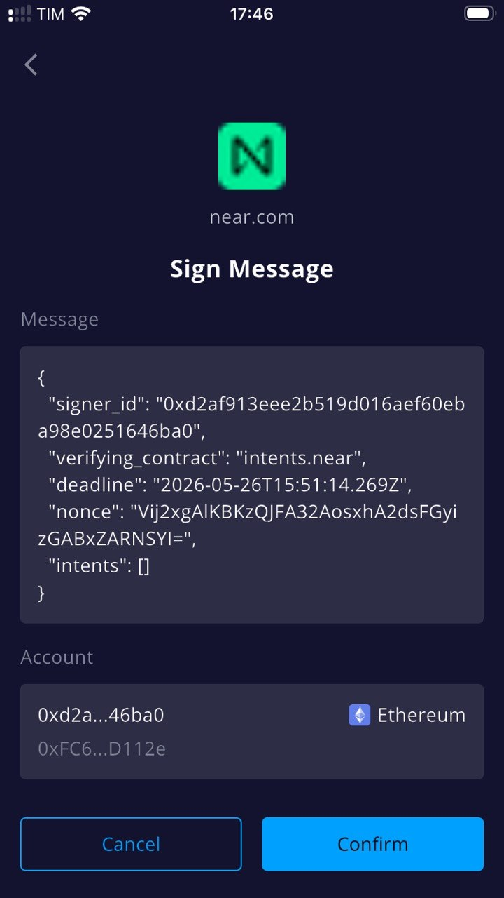

7. Clicca "**Receive**" e seleziona "**From wallet or exchange**". Poi seleziona la rete da cui vuoi depositare.
   *Se il tuo DeGate Wallet ha già un saldo disponibile, clicca semplicemente su "Deposit from connected wallet", inserisci l'importo e clicca Deposit: la transazione di deposito viene inviata.*

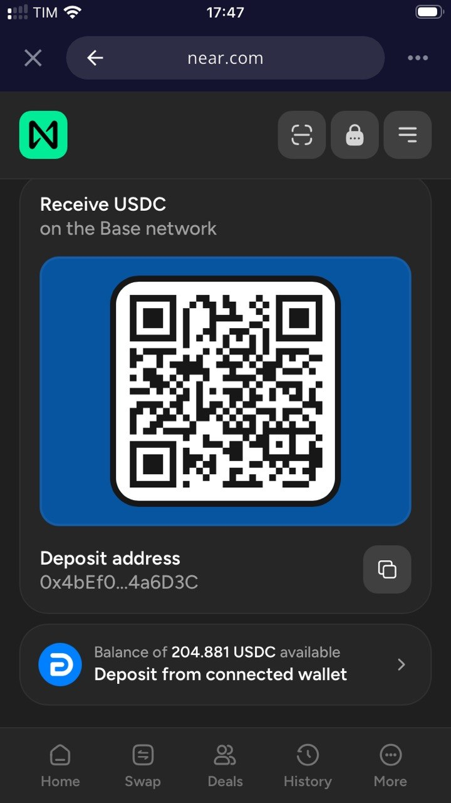

8. Una volta ricevuto il deposito su near.com, puoi attivare il **Confidential Mode**.

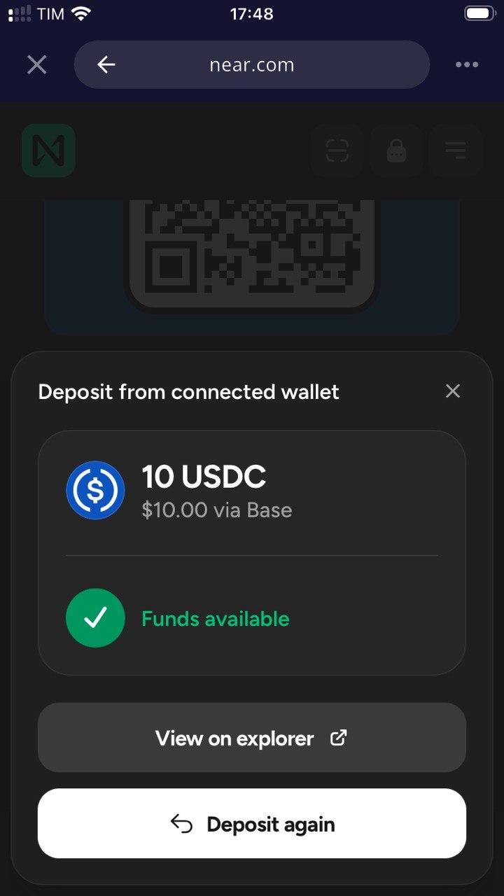

9. Clicca sull'icona **Lock (Lucchetto)** in alto a destra. Da qui entri in Confidential Mode (tema scuro).

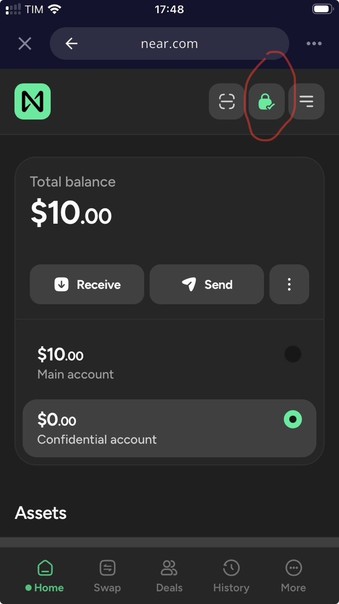

10. Trasferisci i fondi dal Main Account al Confidential Account. Clicca "**Transfer**" e inserisci l'importo che vuoi trasferire alla parte confidenziale.

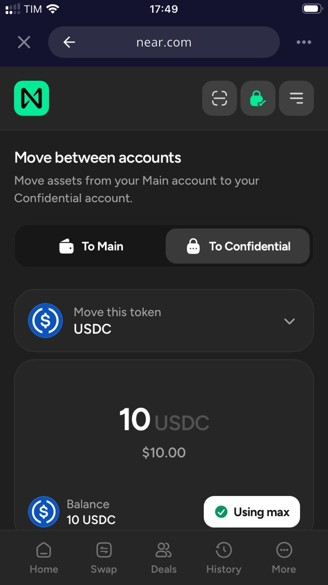

11. Una volta che hai i fondi nel Confidential Account, puoi fare transazioni "confidential".
    Clicca sulla tendina del saldo USDC: vedrai le opzioni **Swap**, **Send** e **Move to Main**. Le operazioni che fai da qui sono tutte confidenziali.

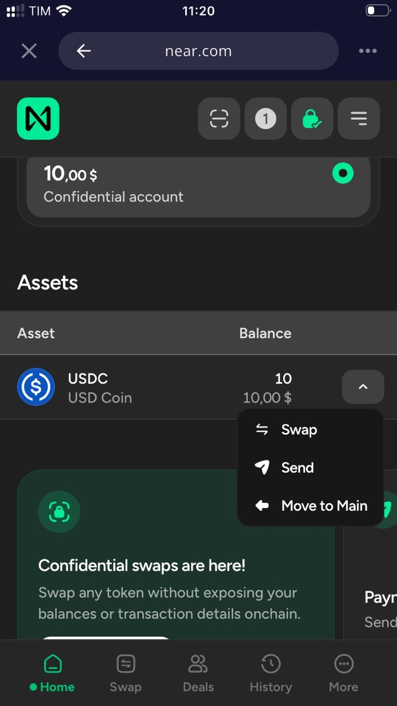

12. **Effettua uno Swap Confidential**.
    Puoi fare swap verso molti token. Controlla la lista dei token supportati.
    Con Confidential swaps, lo swap viene eseguito attraverso Confidential Intents. I solver competono per offrire esecuzione, ma i dettagli sensibili non vengono esposti pubblicamente nello stesso modo di uno swap trasparente.
    In questo esempio, compriamo BTC in modo confidential. Quindi scegli BTC come token da acquistare e invia il trade.

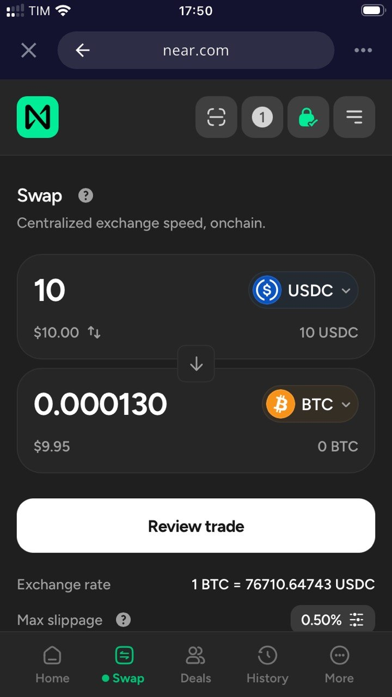

> **💡 Nota:** Le transazioni swap in Confidential Mode non sono archiviate né visualizzabili nella History pubblica.

13. **Send in Confidential Mode**.
    Per i saldi che hai in Confidential Mode, puoi inviarli a un altro address. 
    Nella nostra prova:
    - l'invio di USDC risulta da un wallet etichettato come "Near Intent".
    - l'invio di BTC risulta da un wallet senza etichetta.

---

## Limiti Attuali e Considerazioni OP-SEC

Anche se NEAR Confidential Mode offre ottime garanzie, ci sono limiti da tenere a mente per un uso consapevole (vedi approfondimenti su [Privacy Coins](/privacy-coins/)):

- **Punti di osservazione**: I depositi e i prelievi tra parte pubblica (Main) e parte privata (Confidential) possono creare punti osservabili sulla blockchain.
- **Metadati e Comportamento**: La riservatezza può essere indebolita da metadati, *timing* (tempistiche ravvicinate), importi molto specifici e comportamenti ripetitivi.

---

## Conclusioni

Per l'utente normale, NEAR Confidential Mode significa maggiore privacy finanziaria, simile a un conto bancario in cui non tutti possono leggere i tuoi movimenti.
Per i trader DeFi avanzati, significa meno esposizione a MEV (Maximal Extractable Value), frontrunning e analisi on-chain predatoria.
Per aziende e istituzioni, può significare pagamenti, treasury e posizioni meno visibili al pubblico, mantenendo una logica di disclosure selettiva per esigenze legali o di audit (come discusso anche per le [Crypto Card Custodial](/guide/crypto-card-e-fisco-differenze-tra-carte-custodial/)).

Non è una privacy assoluta, ma è una privacy pratica, opzionale e fortemente orientata all'esecuzione.

---

Questo sito è sostenuto e sponsorizzato da [DeGate Wallet](https://app.degate.com/it/?s=jack18&utm_source=it_privacy_site&utm_content=NEAR), un eccezionale self-custody wallet multi-chain orientato alla massima privacy e sicurezza. Scopri anche la nuova **DeGate Card**!
